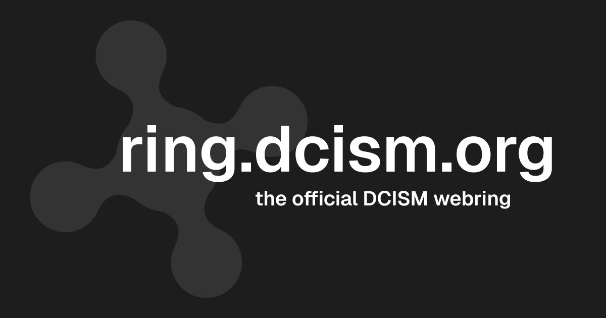

[](https://validator.nu/?doc=https%3A%2F%2Fcs.uwatering.com%2F)


<figure>
  
  <figcaption style="text-align: center; font-style: italic;">
    A webring for Computer Science students & alumni at the University of San Carlos in Cebu, Philippines. Proudly deployed on the DCISM servers at <a href="https://ring.dcism.org" rel="external" target="_blank">ring.dcism.org</a>.
  </figcaption>
</figure>

## Joining the Webring

1. Fork this repo and add your information to the **BOTTOM** of `webring[]` in `/src/data/webring.ts` following this format:
   ```ts
   {
     name: "Your Name", // your full name
     year: "20XX", // your (year | expected year) of graduation 
     url: "https://your-website.com", // your personal website
   }
   ```
2. Submit a Pull Request using your fork & wait patiently for maintainer approval.

## Q&A

#### _I'm not in DCISM. Can I still join?_

> Thank you for your interest! However, this webring is strictly for DCISM (Information Technology, Computer Science, Information Systems, Mathematics) students.
>
> If none of these are a fit, you can make your own! Webrings are a fantastic way to find new people, and don't take much technical skill to create.

#### _Do you accept alumni and post-grad students?_

> Yep, as long as you studied in any of the courses offered by DCISM. Just indicate your graduated year in the webring file.

#### _Can I change my details (name, year, URL) later?_

> Yes! What you can't change, however, is your position in the `webring[]` array. We'll consider randomizing the positions so that this won't be an issue in the future (when more people join). At the moment, please respect the early birds.

## Credits & Inspiration

This project draws inspiration from the [the University of Waterloo Computer Science Webring](https://github.com/JusGu/uwatering).

We'd also like to thank DCISM for allowing students to host websites on their servers.